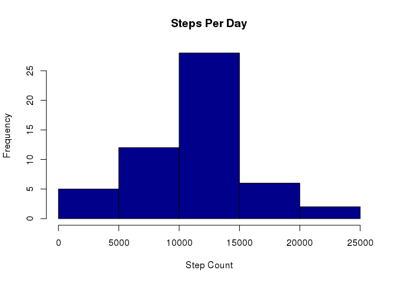

# Reproducible Research Assignment 1
Farhan Ahmad  
11/16/2014  


```
## Loading required package: knitr
```

### Load and Transform Data.

```r
file <- './activity.csv'
if(!file.exists(file)) {
   stop('File ',file,' does not exist in your current working directory!') 
}
data <- read.csv(file,header = T,sep = ',',)
filteredData <- na.omit(data)
```


### Plot Histogram of Total Steps Taken per Day.

```r
stepsPerDay <- aggregate(filteredData$steps,
                         by=list(filteredData$date),FUN=sum)
names(stepsPerDay) <- c('date','steps')

hist(stepsPerDay$steps,col='dark blue',
     xlab='Step Count',main='Steps Per Day')
```

 


### Calculate and Display Mean and Median Steps Per Day.

```r
meanDailySteps   <-  as.integer(mean(stepsPerDay$steps,na.rm = T))
medianDailySteps <-  as.integer(median(stepsPerDay$steps,na.rm=T))
```
Mean steps per day is 10766 and median steps per day is 10765.


### Plot the Step Count of Every 5 Minute Interval Averaged over All Days.

```r
meanStepCount <- aggregate(filteredData$steps,
                           by=list(filteredData$interval),
                           FUN=mean)
names(meanStepCount) <- c('interval','steps')
plot(meanStepCount$interval, meanStepCount$steps, 
     type='l',col='dark blue', 
     xlab='Interval Id',ylab='Average Step Count',
     main = 'Average Steps Per Interval')
```

 

```r
maxActiveInterval <- meanStepCount$interval[which.max(meanStepCount$steps)]
```
5 minute interval with maximum step count is 835.


### Imputting Missing Values.
1. Report number of missing values.

```r
n.missing <- nrow(data) - nrow(filteredData)
```

Number of rows with missing data (step count) is 2304.
 
Every missing value (step count) is replaced by the average step count for the
5 minute interval corresponding to the missing value.

```r
imputedData <- data
index.missing <- which(is.na(imputedData$steps))

for(i in index.missing) {
    intervalID <- imputedData[i,]$interval
    mean <- meanStepCount[meanStepCount$interval == intervalID,]$steps
    imputedData$steps[i] <- mean
}
```


### Plot Histogram of Total Steps per Day with Imputed Data.

```r
stepsPerDay <- aggregate(imputedData$steps,
                         by=list(imputedData$date),
                         FUN=sum)
names(stepsPerDay) <- c('date','steps')
hist(stepsPerDay$steps,col='dark red',
     xlab='Step Count',main='Steps Per Day')
```

 


### Calculate and Display Mean and Median Steps Per Day with Imputed Data.

```r
meanDailySteps   <- as.integer(mean(stepsPerDay$steps))
medianDailySteps <- as.integer(median(stepsPerDay$steps))
```
Mean steps per day is 10766 and median steps per day is 10766.


### Analyze Activity Pattern for Weekdays and Weekends.

```r
weekdays <- weekdays(as.Date(imputedData$date))
weekdays.factor <- as.factor(
                             ifelse(weekdays %in% c('Saturday','Sunday'),
                                    'weekend',
                                    'weekday'))
imputedData <- cbind(imputedData,weekdays.factor)
```


### Plot the Step Counts of Every 5 Minute Interval Averaged over Weekdays and Weekends.

```r
weekendData <- imputedData[imputedData$weekdays.factor == 'weekend',]
weekdayData <- imputedData[imputedData$weekdays.factor == 'weekday',]

weekendMeanSteps <- aggregate(weekendData$steps,
                              by=list(weekendData$interval),
                              FUN=mean)
weekdayMeanSteps <- aggregate(weekdayData$steps,
                              by=list(weekdayData$interval),
                              FUN=mean)
names(weekendMeanSteps) <- c('interval','steps') -> names(weekdayMeanSteps)

par(mar = c(2.0,2.0,1.5,1.5))
par(mfrow = c(2,1))

plot(weekendMeanSteps$interval, weekendMeanSteps$steps,
     type='l',col='dark red', 
     xlab='Interval', ylab='Steps'
     ,main='weekend')

plot(weekdayMeanSteps$interval, weekdayMeanSteps$steps,
     type='l',col='dark blue',
     xlab='Interval', ylab='Steps',
     main='weekday')
```

 
